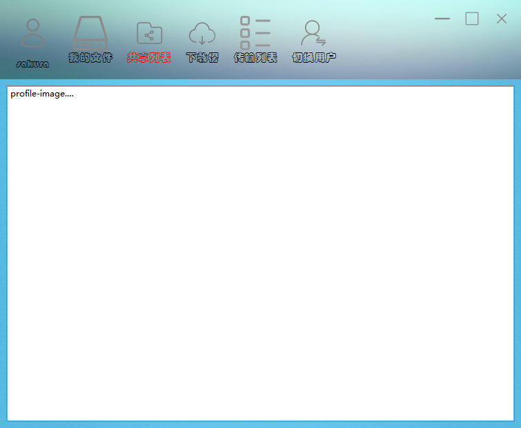

# CloudDisk
基于C/C++实现的高负载的分布式云存储（网络云盘）

## 项目介绍
为了满足海量用户、海量文件的云端存储需求，特提出一个基于Nginx和FastDFS的分布式云存储解决方案，用户可以实现文件上传、下载与分享。服务器已经部署在云端，下载Win32客户端注册登录即可使用。

## 架构
- 将Nginx用作反向代理服务器，可连接多台基于Nginx的web服务器，实现负载均衡
- 用spawn-fcgi转发处理客户端发来的命令请求，交给FastCGI包裹的cgi程序处理
- 采用FastDFS的分布式存储，通过追踪器管理多个存储结点，提高存储容量
- 项目采用mysql存储用户与文件信息，用redis存储用户的token与共享文件信息
    

## 功能
- 支持用户登录注册功能
    >登录：客户端发送用户信息，web服务器转发请求，对应cgi程序解析出用户信息，查询user表，查询到用户且密码匹配，登录成功

    >注册：客户端发送用户信息，web服务器转发请求，对应cgi程序解析出用户信息，查询user表，记录新用户信息
- 支持文件上传、下载
    >上传：客户端发送文件数据，web服务器转发请求，对应cgi程序解析文件信息，并将文件通过fastDFS的API发送到存储节点中，并将文件的存储路径、md5值等信息存储到file_info表中，将用户文件信息存储到user_file_list表中

    >下载：客户端用户文件列表同时存储了文件的url，存储结点部署了nginx服务器，可直接通过url进行下载，同时客户端要发送更新文件pv操作数的请求，web服务器转发请求，对应cgi程序更新文件下载次数
- 支持文件删除、共享、秒传
    >删除：客户端发送要删除文件信息，web服务器转发请求，对应cgi程序解析文件信息，根据md5值查询file_info表中文件云端存储路径，通过fastDFS的API删除存储结点上的文件，并删除所有表中该文件相关的条目

    >共享：客户端发送要共享文件信息，web服务器转发请求，对应cgi程序解析文件信息，根据md5值查询shared_file_info表，将未分享过的文件信息，存储到共享文件列表中

    >秒传：客户端发送文件数据，web服务器转发请求，对应cgi程序解析出文件信息，根据md5值查询file_info表，判断文件是否已上传过，若上传过，仅需要将文件的计数器加1，并更新相关表值即可

## 演示
<p align="center">
    
</p>

<p align="center">
    
</p>

<p align="center">
    
</p>

## 目录树
```
 .
├── resources
│   ├── package.zip           项目需要库的源码
│   └── client.zip            Win32客户端程序
├── bin_cgi                   可执行cgi程序文件夹
│   └──
├── include                   common文件夹对应头文件
│   └──
├── common                    通用库文件夹
│   ├── base64.c              base64编码，简单加密，方便跨平台传输
│   ├── cfg.c                 配置文件读取
│   ├── cJSON.c               json读写
│   ├── deal_mysql.c          mysql读写
│   ├── des.c                 des加密算法（对称加密）
│   ├── make_log.c            日志读写
│   ├── md5.c                 md5编码，文件、用户标记
│   ├── redis_op.c            redis接口与key相关的操作
│   └── util_cgi.c            cgi后台通用接口
├── conf                      配置文件夹
│   ├── cfg.json              各结点的ip与端口信息
│   ├── client.conf           fastDFS客户端配置文件
│   ├── nginx.conf            nginx服务器配置文件
│   ├── mod_fastdfs.conf      nginx服务器fastDFS插件配置文件
│   ├── redis.conf            redis配置文件
│   ├── storage.conf          fastDFS存储节点配置文件
│   └── tracker.conf          fastDFS追踪器配置文件
├── logs                      日志文件夹
│   ├── cgi                   cgi程序日志
│   └── database              数据库日志
├── redis                     redis文件夹
│   ├── dump.rdb              持久化数据
│   ├── redis.log             日志
│   └── redis.pid             进程号
├── mysql                     mysql文件夹
│   └── cloud_disk.sql        建表需要的sql文件
├── fastdfs                   fastdfs文件夹
│   ├── trakcer               追踪器日志路径
│   ├── client                客户端日志路径
│   └── storage               存储结点日志路径
├── src_cgi                   cgi程序源文件
│   ├── dealfile_cgi.c        分享、删除文件、文件pv字段处理CGI程序
│   ├── dealsharefile_cgi.c   共享文件pv字段处理、取消分享、转存文件CGI程序
│   ├── login_cgi.c           登陆后台CGI程序
│   ├── md5_cgi.c             秒传功能的CGI程序
│   ├── myfiles_cgi.c         用户列表展示CGI程序
│   ├── reg_cgi.c             注册后台CGI程序
│   ├── sharefiles_cgi.c      共享文件列表展示CGI程序
│   └── upload_cgi.c          上传文件后台CGI程序
├── redis.sh                  redis启动脚本
├── fastdfs.sh                fastDFS启动脚本
├── fcgi.sh                   cgi程序启动脚本，一个cgi程序一个进程
├── nginx.sh                  nginx启动脚本
├── start.sh                  服务器启动脚本
├── Makefile
└── README.md
```
## 环境与配置
- Ubuntu 16.04以上/Centos 7.6以上
- nginx 1.10.1 （同时用作web服务器和存储结点服务器）
- fastcgi 2.4.1 （创建守护进程执行cgi程序）
- spawn-fcgi 1.6.4 （对nginx收到的命令请求进行转发)
- MySQL 5.7.31 （用来存储用户信息，文件信息）
- redis 3.2.8 （存储用户的token与共享文件信息）
- hiredis（C操作redis的API） 
- fastDFS 5.10 （分布式存储系统，包括客户端、追踪器、存储结点）
- fastdfs-nginx-module 1.16 （存储结点nginx服务器fastDFS插件）
>需要用到的安装包都在package目录下\
建议将项目放到home目录下，然后将配置文件与脚本文件中的路径替换成自己的用户名即可，也可参考CONFIG.md从头开始配置

## 服务器部署
- 导入数据库表
    登录数据库，用`create database cloud_disk;`新建一个空数据库cloud_disk，然后用`use cloud_disk;`进行切换,再用`source ./cloud_disk.sql;`导入
- 生成可执行的cgi程序\
    在当前目录下执行make编译,src_cgi目录下的cgi程序编译后，生成的可执行文件放在bin_cgi目录下，执行ldd命令，检查动态链接库是否能找到
- 修改配置文件\
    修改cfg.json中的相关数据，与前面修改的配置文件一致
- 执行启动脚本文件\
    sudo ./start.sh

## 客户端安装使用
已将Qt编写的客户端程序打包成Win32平台的免安装程序，放在resources/client.rar，下载解压后点击CloudDisk，设置服务器地址与端口，然后注册并登录，即可使用
